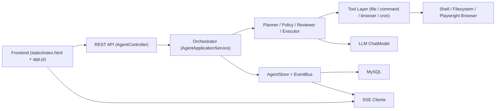

# 当前系统架构文档

## 1. 系统概览

本项目是一个基于 Spring Boot 的本地 Agent MVP，提供网页对话入口，接收用户任务后由后端完成推理循环、工具执行、审批控制、事件推送和结果持久化。

当前系统的核心技术栈与组成如下：

- 后端框架：Spring Boot 4
- 前端形态：
  - `web/` 下的 Vue 3 前端工程
  - `src/main/resources/static/` 下保留的静态页面版本
- 通信方式：REST API + SSE
- Agent 核心：`AgentApplicationService`
- 推理层：`Planner` / `TaskPlanner`
- 执行层：`ToolExecutor` + `ToolRegistry`
- 存储层：`AgentStore`，当前优先使用 `MybatisPlusAgentStore`
- 数据库：MySQL
- 大模型接入：LangChain4j `ChatModel`
- 本地能力：文件、命令、浏览器、定时任务
- IM Channel：飞书/钉钉长连接接入、异步回推与通知路由
- 默认工作目录：`~/.nomoclaw`

应用入口位于 [BotApplication.java](../../src/main/java/ai/nomoclaw/bot/BotApplication.java)。

## 2. 模块分层

系统按职责可以分为五层：

1. 接入层  
   Vue 前端与静态页面都负责发起对话、提交消息、订阅 SSE、展示计划和执行日志。

2. API 层  
   `AgentController` 提供对话、消息提交、审批、取消、SSE 订阅接口。

3. 编排层  
   `AgentApplicationService` 负责消息创建、推理循环、步骤执行、重试、审批暂停、最大轮次保护、事件落库与推送。

4. 能力层  
   包括推理器 `TaskPlanner`、风险策略 `RiskPolicy`、结果评审 `StepReviewer`、工具执行器 `ToolExecutor`、工具规格注册器 `ToolSpecificationRegistry` 与具体工具实现。

5. 基础设施层  
   包括 `MybatisPlusAgentStore`、MySQL、`AgentEventBus`、Playwright、Shell、本地文件系统。

另外，当前已引入独立 Channel 子系统（`ai.nomoclaw.bot.agent.channel`）：

- 入站连接器：飞书 WebSocket、钉钉 Stream SDK
- 编排入口：`ChannelManager` + `ChannelOrchestratorService`
- 出站路由：`ChannelMessageRouter` + 各平台 sender
- 会话与幂等：`agent_channel_session`、`agent_channel_inbound_log`

## 3. 端到端执行链路

一次典型任务的执行路径如下：

1. 前端调用 `POST /api/conversations` 创建对话。
2. 前端调用 `POST /api/conversations/{conversationUid}/messages` 提交用户消息。
3. `AgentApplicationService` 创建 `agent_message` 中的用户消息记录，并把消息执行投递到 `agentTaskExecutor` 异步线程池执行。
4. loop 进入当前 round；如果当前 round 还没有待执行步骤，则先调用模型进行一轮 reasoning。
5. 如果模型返回 tool calls，则将其写入 `agent_step` 并发送 `PLAN_CREATED` 事件；如果没有 tool calls，则直接视为最终回答。
6. 编排层逐步读取当前 round 的步骤并执行：
   - 先做风险审批判断
   - 再通过 `ToolExecutor` 分发到具体工具
   - 再由 `StepReviewer` 判断是否满足完成条件
7. 执行中的每个关键节点都会：
   - 记录状态到数据库
   - 追加 `agent_event`
   - 通过 `AgentEventBus` 推送给 SSE 客户端
8. 当前 round 的工具结果会被追加回运行时 memory，下一轮继续 reasoning；如果模型不再请求工具，则消息立即完成；如果达到最大循环次数，则进入 summarizing 并终止。
9. 消息处理完成、失败、取消后，统一发送 `MESSAGE_COMPLETED` 或 `MESSAGE_CANCELED` 事件。

## 3.2 IM Channel 双阶段链路

当前 IM 链路采用“入站 ACK + 完成事件回推”的双阶段模型，已去除 Channel 层查库轮询等待：

1. 飞书/钉钉连接器收到平台消息后，写入 `InboundEnvelope` 并入 `ChannelManager` 队列。
2. `ChannelManager` 消费时按 `channel + sessionKey` 串行锁，同会话串行、跨会话并行。
3. `ChannelOrchestratorService` 执行同步阶段：
   - 入站去重
   - 会话绑定到 `conversationUid`
   - 发送处理中 ACK
   - 调用 `submitMessage(...)` 提交任务
   - 记录 `messageUid -> (channel, replyTarget, conversationUid)` 的待回推上下文
4. `AgentApplicationService` 在 `COMPLETED/FAILED/CANCELED` 时发布 `ChannelMessageCompletedEvent`。
5. `ChannelCompletionListener` 监听完成事件，读取待回推上下文并发送最终消息，成功后清理上下文。
6. 待回推上下文采用进程内 `ConcurrentHashMap`，并带 TTL 清理线程避免内存泄漏。

## 3.1 启动初始化与默认工作区

应用启动时会执行工作区初始化：

- 检查 `~/.nomoclaw` 是否存在
- 若不存在则自动创建
- 确保 `~/.nomoclaw/agents/default` 存在
- 自动补齐默认 agent 的 6 个 prompt 文件：`AGENTS.md`、`SOUL.md`、`IDENTITY.md`、`USER.md`、`TOOLS.md`、`MEMORY.md`

相关实现：

- [NomoClawWorkspaceInitializer.java](../../src/main/java/ai/nomoclaw/bot/agent/config/NomoClawWorkspaceInitializer.java)
- [NomoClawWorkspaceBootstrap.java](../../src/main/java/ai/nomoclaw/bot/agent/config/NomoClawWorkspaceBootstrap.java)
- [NomoClawPaths.java](../../src/main/java/ai/nomoclaw/bot/agent/config/NomoClawPaths.java)

## 4. Agent Loop 与状态机

Agent loop 的详细控制流、round/retry 区分、审批暂停、失败重规划、最大循环次数保护，已经单独整理到：

- [LOOP-ARCHITECTURE.md](./LOOP-ARCHITECTURE.md)

### 4.1 任务状态

当前任务状态枚举为：

- `CREATED`
- `PLANNED`
- `RUNNING`
- `REPLANNING`
- `WAITING_APPROVAL`
- `COMPLETED`
- `FAILED`
- `CANCELED`

消息由 `AgentApplicationService` 驱动，核心控制逻辑是“统一 round loop 下的 reasoning + acting + tool result 回填 + 最大 round 保护”。

### 4.2 步骤状态

当前步骤状态枚举为：

- `CREATED`
- `RUNNING`
- `WAITING_APPROVAL`
- `COMPLETED`
- `FAILED`
- `CANCELED`

其中当前主执行路径实际使用的是：

- `CREATED`
- `RUNNING`
- `WAITING_APPROVAL`
- `COMPLETED`
- `FAILED`

### 4.3 Loop 与重试

- 每条用户消息有 `max_rounds`
- 每轮是一次完整的 reasoning/acting 轮次，不是单步重试
- 单个步骤内部仍可重试，默认上限来自 `agent.retry.max-attempts`
- round 达到上限后，消息标记为 `FAILED`，并由模型生成最终总结

### 4.4 审批暂停

当 `RiskPolicy` 判断当前步骤需要审批时：

- 步骤进入 `WAITING_APPROVAL`
- 任务进入 `WAITING_APPROVAL`
- 前端收到 `STEP_WAITING_APPROVAL` 事件并展示批准按钮
- 用户调用审批接口后，任务重新进入执行

## 5. LLM 推理层

规划器实现位于 [TaskPlanner.java](../../src/main/java/ai/nomoclaw/bot/planner/TaskPlanner.java)。

### 5.1 模型接入方式

规划层通过 LangChain4j `ChatModel` 统一接入不同模型。当前 `ChatModelConfig` 支持：

- `codex`
- `ollama`
- `qwen`

其中：

- `codex` 使用项目内自定义 `CodexChatModel`
- `ollama` 使用 `OllamaChatModel`
- `qwen` 统一使用 DashScope OpenAI 兼容接口 URL：`https://dashscope.aliyuncs.com/compatible-mode/v1`

模型装配入口位于 [ChatModelConfig.java](../../src/main/java/ai/nomoclaw/bot/agent/config/ChatModelConfig.java)。

### 5.2 提示词来源

系统提示词默认回退文件来自：

- `src/main/resources/prompts/AGENTS.md`

如果 `llm.system-prompt` 有显式配置，则优先使用配置值。

当会话绑定具体 agent 时，系统会优先从对应 workspace 读取 prompt 文件：

- `~/.nomoclaw/agents/{agentName}/AGENTS.md`
- `~/.nomoclaw/agents/{agentName}/SOUL.md`
- `~/.nomoclaw/agents/{agentName}/IDENTITY.md`
- `~/.nomoclaw/agents/{agentName}/USER.md`
- `~/.nomoclaw/agents/{agentName}/TOOLS.md`
- `~/.nomoclaw/agents/{agentName}/MEMORY.md`

加载顺序固定与上面一致；若 workspace 缺失或没有有效内容，则回退默认 `AGENTS.md`。

### 5.3 调用方式

推理器对所有 provider 都显式发送：

- `SystemMessage`
- memory 中的历史消息

同时：

- 若本轮允许使用工具，则附带 tool specifications 与 `ToolChoice.AUTO`
- 若进入收束总结，则使用 `ToolChoice.NONE`
- 每次调用都会打印系统提示词与 tool call 数量日志，便于调试

### 5.4 输出约定

当前主路径不再要求模型返回固定 JSON。  
模型只需要遵循两种自然输出之一：

- 若需要工具：返回模型原生 tool calls
- 若不需要工具：直接输出最终自然语言回答

## 6. 工具层

工具统一实现接口：

- `Tool.name()`
- `Tool.execute(ToolRequest)`

工具通过 `ToolRegistry` 注册，并由 `ToolExecutor` 根据 `PlanStep.toolName` 分发。

当前工具暴露不是全局固定，而是“全局主数据 + agent 关联授权”：

- 全局主数据表：`tool_definition`
- agent 关联表：`agent_tool_relation`

`ToolSpecificationRegistry` 会按当前 `agentName` 返回已授权的 tool specifications；`ToolExecutor` 在真正执行前也会再次校验权限。

### 6.1 `file_tool`

能力：

- `read`
- `list`
- `write`

特点：

- 直接访问本地文件系统
- `write` 会写入目标路径
- 返回内容、绝对路径、长度等信息

### 6.2 `command_tool`

能力：

- 执行本地 shell 命令

实现特点：

- 基于 `ProcessBuilder("bash", "-lc", command)`
- 支持 `cwd`
- 支持超时控制
- 返回 `stdout / stderr / exitCode`

这是当前系统中最直接的本地执行能力，也是高风险判断的重点来源之一。

### 6.3 `browser_tool`

能力：

- `open`
- `click`
- `type`
- `extract_text`
- `screenshot`

实现特点：

- 基于 Playwright
- 浏览器以 headless 方式启动
- 使用持久化 profile（`launchPersistentContext`），可跨会话复用登录态（cookie/session）
- profile 按 agent 维度隔离（优先 `agentUid`，回退 `agentName`）
- 在同一会话内复用页面实例（按 `conversationUid`），减少重复开页
- 每步使用 `timeoutMs` 设置超时

持久化目录约定：

- `~/.nomoclaw/runtime/browser-profiles/<agent-key>/`
- `~/.nomoclaw/runtime/plugins/browser/`
- `~/.nomoclaw/runtime/tmp/`
- `~/.nomoclaw/runtime/logs/backend-YYYYMMDD.log`

Playwright 浏览器二进制缓存目录（下载目录）采用以下优先级：

1. `NOMOCLAW_PLAYWRIGHT_BROWSERS_PATH`（应用级显式覆盖，最高优先级）
2. `PLAYWRIGHT_BROWSERS_PATH`（用户级显式覆盖；若值为 `0` 表示不显式指定缓存目录，交给 Playwright 默认逻辑）
3. 平台默认回退：
   - macOS：若 `~/Library/Caches/ms-playwright` 已存在，优先复用该目录
   - 其他情况（含 Linux/Windows）：`~/.nomoclaw/runtime/playwright-browsers/`

在 Windows 上，若未配置上述环境变量，默认目录等价于：

- `C:\Users\<username>\.nomoclaw\runtime\playwright-browsers`

其中 `<agent-key>` 会做字符规范化，只保留 `[a-zA-Z0-9._-]`。

迁移说明（硬迁移）：

- 旧目录 `~/.nomoclaw/{browser-profiles,playwright-browsers,plugins,tmp,logs}` 不再自动兼容。
- 升级后如需保留历史数据，请手工迁移到 `~/.nomoclaw/runtime/*`。

下载与进度上报说明：

- 启动阶段默认设置 `PLAYWRIGHT_SKIP_BROWSER_DOWNLOAD=1`，避免每次创建上下文都触发安装。
- 检测到本地缺失可执行 Chromium 时，才调用 Playwright CLI 安装，并在安装环境中临时切换为 `PLAYWRIGHT_SKIP_BROWSER_DOWNLOAD=0`。
- 进度优先解析 Playwright CLI stdout 中的真实百分比（如 `90% of ...`）；若无法可靠解析，前端以“不确定进度”样式展示，避免误导性固定百分比。
- 下载链路中断（例如 `server closed connection`）时，安装器会重试并可能从 0% 重新开始，通常不保证断点续传。

### 6.4 `cron_tool`

能力：

- 创建本地定时任务触发器

实现特点：

- 基于 `ThreadPoolTaskScheduler`
- 支持 5/6 段 cron 表达式，5 段会自动补齐秒位
- 创建任务时先写入 `agent_cron_job`
- 应用启动时会尝试恢复 `ACTIVE` 任务
- 内存中的 `jobs` 仅用于持有当前进程调度句柄，不再是任务真源

### 6.5 Cron 结果直推（Channel Fanout）

当前 Cron 执行完成后，支持按显式订阅将结果直推到飞书/钉钉：

- 订阅模型：`agent_cron_subscription`
- 扇出服务：`CronNotificationFanoutService`
- 发送策略：
  - 同一任务支持订阅目标列表（当前 UI 约束为单通道）
  - 单目标失败不影响其他目标
  - 支持有限重试（指数退避）
- 目标解析：
  - 若订阅配置显式 `target`，按 target 发送
  - 若 `target` 为空，则按 channel 自动解析最近活跃会话 `replyTarget`

## 7. 风险控制与审批

风险控制由 `RiskPolicy` 实现。

当前高风险判断规则包括：

- 步骤风险级别为 `HIGH`
- 命令中包含危险特征，例如 `rm`、`sudo`、`mv`
- 文件工具的 `write`
- 浏览器工具的 `click` 和 `type`

对应审批接口：

- `POST /api/conversations/{conversationUid}/approvals/{stepUid}`

执行行为：

- 未审批前不继续执行该步骤
- 审批通过后把步骤状态恢复到 `CREATED`
- 如果任务当前处于 `WAITING_APPROVAL`，则重新投递异步执行

## 8. 持久化模型

当前数据库使用以下核心表：

### 8.1 `agent_conversation`

用途：

- 保存对话基础信息

关键字段：

- `conversation_uid`
- `created_time`
- `updated_time`

### 8.2 `agent_message`

用途：

- 保存单次用户任务及其整体执行状态

关键字段：

- `conversation_uid`
- `message_uid`
- `parent_message_uid`
- `role`
- `content`
- `status`
- `provider`
- `model_name`

### 8.3 `agent_step`

用途：

- 保存规划出的步骤及其执行状态

关键字段：

- `step_uid`
- `message_uid`
- `conversation_uid`
- `round_index`
- `step_index`
- `title`
- `tool_name`
- `tool_args`
- `done_criteria`
- `risk_level`
- `status`
- `retry_count`
- `approval_status`
- `last_error`

### 8.4 `agent_event`

用途：

- 记录任务审计事件
- 为前端实时日志与后续排障提供基础数据

关键字段：

- `event_uid`
- `conversation_uid`
- `message_uid`
- `step_uid`
- `event_type`
- `payload`
- `created_time`

### 8.5 `tool_definition`

用途：

- 保存全局工具主数据

关键字段：

- `tool_key`
- `display_name`
- `description`
- `risk_level`
- `status`
- `sort_index`

### 8.6 `agent_tool_relation`

用途：

- 保存 agent 与工具的授权关系

关键字段：

- `agent_uid`
- `tool_key`
- `status`
- `sort_index`

### 8.7 `skill_definition`

用途：

- 保存全局 skill 主数据

关键字段：

- `skill_key`
- `display_name`
- `description`
- `skill_path`
- `status`
- `sort_index`

### 8.8 `agent_skill_relation`

用途：

- 保存 agent 与 skill 的授权关系

关键字段：

- `agent_uid`
- `skill_key`
- `status`
- `sort_index`

### 8.9 `agent_cron_job`

用途：

- 持久化 cron 任务及其运行状态

关键字段：

- `job_uid`
- `agent_uid`
- `conversation_uid`
- `message_uid`
- `expression`
- `timezone`
- `task_content`
- `status`
- `last_run_time`
- `next_run_time`
- `last_result`

### 8.10 `agent_cron_subscription`

用途：

- 持久化 cron 任务与 channel 推送订阅关系

关键字段：

- `subscription_uid`
- `job_uid`
- `channel`
- `target`
- `enabled`

### 8.11 `agent_channel_session`

用途：

- 维护 channel 会话到 `conversationUid` 的映射
- 记录回复目标 `replyTarget`，供异步回推与 cron 自动目标解析复用

关键字段：

- `channel`
- `tenant_id`
- `session_key`
- `conversation_uid`
- `reply_target`

### 8.12 存储实现选择

`AgentStoreConfig` 的策略是：

- 有 MyBatis-Plus Repository 时使用 `MybatisPlusAgentStore`
- 否则回退到 `InMemoryAgentStore`

当前默认启动方式通常会连 MySQL，因此主路径是 JDBC 持久化。

### 8.13 当前开发态限制

当前 [schema-mysql.sql](../../src/main/resources/db/schema-mysql.sql) 在启动时会先执行：

- `DROP TABLE IF EXISTS agent_cron_job`
- `DROP TABLE IF EXISTS agent_cron_subscription`
- `DROP TABLE IF EXISTS agent_skill_relation`
- `DROP TABLE IF EXISTS skill_definition`
- `DROP TABLE IF EXISTS agent_tool_relation`
- `DROP TABLE IF EXISTS tool_definition`
- `DROP TABLE IF EXISTS agent_event`
- `DROP TABLE IF EXISTS agent_step`
- `DROP TABLE IF EXISTS agent_message`
- `DROP TABLE IF EXISTS agent_conversation`
- `DROP TABLE IF EXISTS agent_channel_inbound_log`
- `DROP TABLE IF EXISTS agent_channel_session`

当前数据库初始化是开发态行为，应用重启会清空历史数据。

## 9. 前端接入概览

前端实现位于：
- `web/` 下的 Vue 3 前端工程

前端 REST API、SSE 事件类型、主要请求响应结构与调用流程已经单独拆到文档：

- [FRONTEND-API.md](./FRONTEND-API.md)
- API 接入入口是 `AgentController`
- SSE 推送入口是 `AgentEventBus`
- 事件同时用于前端实时展示和 `agent_event` 审计落库

## 10. 核心模型

当前编排过程中的关键数据类型包括：

- `PlanStep`  
  定义单个规划步骤，包含步骤序号、工具名、参数、风险、完成标准和执行状态。

- `ToolRequest`  
  定义工具执行输入，包含 `conversationUid`、`messageUid`、`stepUid`、`agentUid`、`agentName`、`args`、`timeoutMs`。

- `ToolResult`  
  定义工具执行输出，包含成功状态、文本输出、附加产物、错误码、错误信息、指标信息。

- `AgentEvent`  
  定义 SSE 与审计共用的事件对象。

- `AgentTask`  
  定义任务主实体，包括任务状态、当前 round、最大 round 和停止原因。

相关状态枚举包括：

- `MessageStatus`
- `StepStatus`
- `ApprovalStatus`
- `AgentEventType`

## 11. 当前限制与扩展方向

当前系统明确存在以下限制：

- 默认按单用户本地运行设计，没有多租户和权限系统
- 文件、命令、浏览器能力没有做强隔离
- 计划模型仍是线性步骤，不支持并行 DAG
- 前端偏调试型页面，不是成熟产品化 UI
- 最终任务总结能力较弱，更多依赖工具原始输出和简单汇总
- 浏览器自动化依赖本机 Playwright 环境
- 数据库 schema 初始化会清库，不适合生产持久化

后续可扩展方向包括但不限于：

- 修正锦囊
- 增加命令和文件的沙箱、白名单或作用域限制
- 引入 Flyway/Liquibase 管理数据库版本迁移，替代分散的启动期 schema upgrader
- 增加 Memory 模块，支持工具结果的结构化记忆和检索
- 支持并行步骤或更复杂的执行图
- 将当前调试型前端升级为更完整的任务工作台
