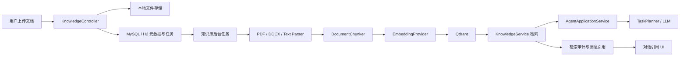

# 知识库与对话检索设计

## 1. 目标与边界

知识库为 NomoClaw 提供本地优先的 RAG（检索增强生成）能力。用户上传文档后，系统会提取文本、分块、生成向量并写入 Qdrant；后续对话根据 Agent 和会话绑定的知识库自动检索，将可信的资料片段注入模型上下文，并在回答中展示来源引用。

首版范围：

- 支持 PDF、DOCX、TXT、Markdown 文件导入。
- 支持 Qdrant dense vector retrieval。
- 支持 Agent 默认知识库和会话级包含/排除覆盖。
- 支持文档导入状态、失败重试、检索测试和回答引用。
- 使用现有模型配置中的 OpenAI-compatible 或 Ollama provider 生成 embedding。

首版不包含 OCR、BM25 混合检索、reranker、网页同步、租户权限模型、桌面 Qdrant sidecar，以及全库重建和异步删除 UI。

## 2. 架构



后端模块位于 `ai.nomoclaw.bot.knowledge`：

- `api`：REST Controller。
- `app`：知识库、导入任务、绑定和检索编排。
- `config`：配置属性和导入线程池。
- `ingestion`：解析器、分块器、embedding provider。
- `vector`：向量存储 SPI 和 Qdrant REST 实现。
- `model`：请求、响应、检索命中模型。

业务数据以 MySQL/H2 为事实来源；Qdrant 只保存向量及最小检索 payload，允许未来从数据库分块重新构建索引。

## 3. 存储设计

原始文件保存到：

```text
${NOMOCLAW_ROOT_DIR}/knowledge/{knowledgeBaseUid}/documents/
```

每个知识库独占一个 Qdrant Collection，名称创建时写入 `knowledge_base.vector_collection_name`，后续修改知识库显示名称不会改变它。名称规则为：

```text
nomoclaw_kb_{nameSlug}_{knowledgeBaseUid前8位}
```

`nameSlug` 仅保留小写 ASCII 字母和数字；中文、空格和其他特殊字符替换为 `_`，连续下划线合并。空或纯中文名称使用 `knowledge_base` 作为可读回退。Collection 名最长 128 个字符；超长时截断 slug，但始终保留 UID 后缀。向量维度由该知识库的 embedding 配置决定。

Qdrant payload 包含：`knowledgeBaseUid`、`documentUid`、`documentVersionUid`、`chunkUid` 和 `enabled`。即使已经使用独占 Collection，查询仍按知识库 UID 过滤，作为额外的数据隔离校验。历史共享 Collection 会在应用启动后后台复制到新的专属 Collection；复制完成前，检索继续使用旧 Collection。

| 表 | 职责 |
| --- | --- |
| `knowledge_base` | 知识库名称、Embedding 模型、分块及检索参数、统计信息 |
| `knowledge_document` | 上传文件、当前版本、处理状态和失败信息 |
| `knowledge_document_version` | 不可变导入版本；新版本成功后才切换为当前版本 |
| `knowledge_chunk` | 分块正文、页码、章节、向量 point ID 和状态 |
| `knowledge_ingestion_job` | 导入任务状态、进度、重试信息 |
| `agent_knowledge_base_relation` | Agent 默认启用的知识库 |
| `agent_conversation_knowledge_base_relation` | Agent 会话级 INCLUDE / EXCLUDE 覆盖 |
| `knowledge_retrieval_log` | 每次检索的查询、耗时、候选数及状态 |
| `agent_message_knowledge_citation` | Agent 用户消息与被引用分块的快照关系 |

数据库迁移位于：

- `src/main/resources/db/migration/mysql/V2__knowledge_base.sql`
- `src/main/resources/db/migration/h2/V2__knowledge_base.sql`
- `src/main/resources/db/migration/mysql/V4__knowledge_base_vector_collection.sql`
- `src/main/resources/db/migration/h2/V4__knowledge_base_vector_collection.sql`

## 4. 导入与索引流程

1. `POST /api/knowledge-bases/{uid}/documents` 接收 multipart 文件。
2. 服务校验扩展名、文件数量和路径安全性，将文件保存到知识库目录。
3. 在事务中创建 document、version 和 ingestion job。
4. 专用 `knowledgeIngestionExecutor` 后台执行解析、分块、embedding 和 Qdrant upsert。
5. 每批向量写入成功后，更新 chunk 和 job 进度。
6. 所有分块成功后，文档版本和文档变为 `READY`，更新知识库统计。
7. 任一阶段失败时，文档和任务变为 `FAILED`，记录稳定错误码与简短原因，可通过 retry API 再次提交。

支持的解析错误码：

- `OCR_REQUIRED`：PDF 没有可提取文本，通常为扫描件。
- `ENCRYPTED_PDF`：加密 PDF。
- `INVALID_ENCODING`：文本不是 UTF-8。
- `EMPTY_DOCUMENT`：没有可索引文本。
- `PARSE_FAILED` / `INGESTION_FAILED`：其他解析或索引失败。

默认分块参数：500 tokens，80 tokens overlap。当前 token 估算使用每 4 个字符约 1 token 的保守近似；后续可替换为 provider 对应 tokenizer。

## 5. Embedding 与 Qdrant

知识库创建时需要指定：

- `embeddingProviderId`
- `embeddingModelId`
- `embeddingDimension`

Embedding provider 从现有模型设置读取 Base URL 与密钥：

- OpenAI-compatible：`POST {baseUrl}/embeddings`，请求体包含 `model` 与 `input`。
- Ollama：`POST {baseUrl}/api/embed`，请求体包含 `model` 与 `input`。

embedding 返回维度必须与知识库维度匹配，否则任务失败，防止不同维度的向量写入同一 collection。

Qdrant 不可用时，导入任务会失败并允许重试；对话检索会降级为空上下文，普通对话不会失败。

## 6. 绑定与检索规则

有效知识库集合按以下规则计算：

```text
Agent 默认知识库
+ 会话 INCLUDE
- 会话 EXCLUDE
```

每条用户消息的首轮推理前执行一次检索：

1. 以当前用户消息文本作为 query。
2. 对有效且 `ACTIVE` 的知识库，按 embedding 指纹分组。
3. 生成 query embedding，向对应 Qdrant collection 发送带知识库过滤条件的查询。
4. 从数据库读取 `READY` 且属于当前文档版本的分块正文。
5. 过滤低于知识库阈值的命中，限制单文档最大命中数和总上下文 token 数。
6. 写入检索日志及消息引用快照。
7. 将上下文作为独立 `SystemMessage` 放在当前用户消息之前。

注入内容必须明确声明：文档内容是参考资料，不能被视为系统指令。模型应使用 `[K1]`、`[K2]` 标记引用；前端只展示后端实际命中的引用，不能相信模型自行编造的文档来源。

## 7. 对话集成

`AgentApplicationService.buildConversationMemory(...)` 负责调用 `KnowledgeService.retrieve(...)`，然后把检索上下文添加到 memory。没有绑定知识库、没有命中或检索异常时，返回空上下文并保持现有对话行为。

Assistant 消息通过父用户消息读取 `agent_message_knowledge_citation`，API 字段为：

```json
{
  "knowledgeCitations": [
    {
      "citationId": "K1",
      "knowledgeBaseName": "产品资料",
      "documentName": "使用手册.pdf",
      "pageFrom": 12,
      "sectionPath": "账户管理 / 权限",
      "excerpt": "命中的原文片段",
      "score": 0.82
    }
  ]
}
```

`MessagesPanel.vue` 使用可展开的引用区展示文档、页码和片段。

## 8. API

| 方法 | 路径 | 说明 |
| --- | --- | --- |
| `POST` | `/api/knowledge-bases` | 创建知识库 |
| `GET` | `/api/knowledge-bases/page` | 查询知识库和 Qdrant 健康状态 |
| `GET` | `/api/knowledge-bases/{uid}` | 获取知识库详情 |
| `PATCH` | `/api/knowledge-bases/{uid}` | 更新名称、描述、检索参数 |
| `POST` | `/api/knowledge-bases/{uid}/documents` | 上传文档，返回 `202 Accepted` |
| `GET` | `/api/knowledge-bases/{uid}/documents/page` | 查询文档和任务进度 |
| `GET` | `/api/knowledge-bases/{uid}/documents/{documentUid}/content` | 下载原始文件 |
| `POST` | `/api/knowledge-bases/{uid}/documents/{documentUid}/retry` | 重试失败导入 |
| `POST` | `/api/knowledge-bases/{uid}/search` | 调试检索 |
| `GET/PUT` | `/api/agents/{agentUid}/knowledge-bases` | 读取/设置 Agent 默认绑定 |
| `GET/PUT` | `/api/conversations/{conversationUid}/knowledge-bases` | 读取/设置会话覆盖绑定 |

## 9. 配置与部署

```yaml
knowledge:
  enabled: true
  storage-root: "${NOMOCLAW_ROOT_DIR:${user.home}/.nomoclaw}/knowledge"
  upload:
    max-file-size: 50MB
    max-request-size: 200MB
    max-files-per-request: 20
  ingestion:
    worker-count: 2
    max-attempts: 3
    embedding-batch-size: 32
  chunking:
    default-size-tokens: 500
    default-overlap-tokens: 80
  retrieval:
    default-top-k: 8
    max-context-tokens: 6000
    default-similarity-threshold: 0.35
    max-chunks-per-document: 3
  vector:
    qdrant:
      url: "${QDRANT_URL:http://127.0.0.1:6333}"
      api-key: "${QDRANT_API_KEY:}"
      timeout: 10s
```

`docker-compose.yml` 已定义 `qdrant` 服务及 `nomoclaw_qdrant` 持久化 volume。源码运行时需自行启动 Qdrant，或设置 `QDRANT_URL` 指向可访问实例。

## 10. 安全与一致性

- 原始文件使用生成的 document UID 命名，不使用用户文件名作为路径。
- 下载接口先通过数据库确认文档归属，不接受任意文件系统路径。
- 文档内容被视为不可信数据，检索上下文中显式阻止其覆盖系统指令。
- 数据库和 Qdrant 没有分布式事务；版本仅在所有块成功索引后切换为当前版本，避免查询到半成品。
- API Key 继续由模型配置的加密存储机制管理，知识库表和日志不保存密钥。
- 当前项目没有租户/用户认证模型，知识库沿用本机访问边界；团队权限需要在身份体系落地后实现。

## 11. 前端

`web/src/pages/KnowledgePage.vue` 提供：

- 知识库列表和 Qdrant 不可用提示。
- 创建知识库与 embedding 模型参数输入。
- 文档上传、进度轮询、失败重试。
- 检索测试及命中片段展示。

对话消息引用由 `web/src/components/chat/MessagesPanel.vue` 展示。

Agent 绑定和会话覆盖 API 已提供；对应的 Agent 管理页和 Composer 选择器仍可在后续迭代中接入。

## 12. 验证

已验证：

- 使用 JDK 21 执行后端编译。
- 前端 `pnpm build` 通过。
- H2 profile 启动成功，V2 knowledge migration 成功执行。

完整测试集当前受现有 Mockito/ByteBuddy 自附加限制、测试写入默认工作目录的沙箱限制，以及既有非知识库断言失败影响；知识库模块建议后续补充 parser、chunker、Qdrant Testcontainers 及会话绑定集成测试。
