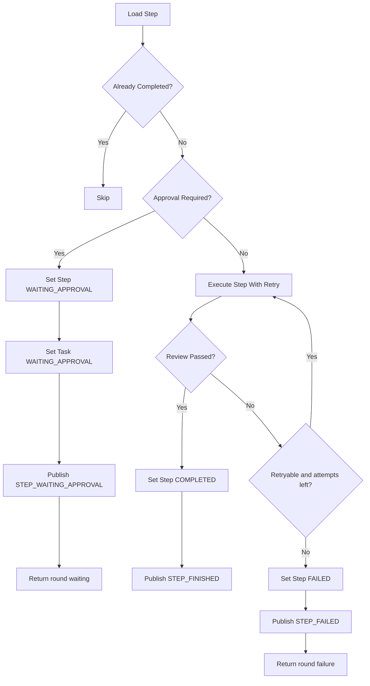

# Agent Loop 架构说明

本文档专门说明当前本地 Agent 的 loop 控制流，包括 memory、reasoning、acting、审批暂停、最大循环次数保护，以及相关状态和事件。

主架构说明见 [ARCHITECTURE.md](./ARCHITECTURE.md)。

## 1. Loop 的定义

当前系统中的 loop 是一个受控的智能体执行循环：

- 每个 round 先让模型基于 memory 做一轮 reasoning
- 如果模型返回 tool calls，则将这些调用保存为当前 round 的步骤并顺序执行
- 每个工具结果都会以 tool result message 的形式回填到 memory
- 当模型不再返回 tool calls 时，当前消息直接完成
- 当 round 数达到上限后，系统进入 summarizing 并终止

这里需要区分两个概念：

- `round`：一次完整的计划执行轮次
- `retry`：同一轮内单个步骤的重复尝试

当前实现是“memory 驱动的线性 tool loop + 步骤内重试”，不支持并行 DAG，也不支持跨步骤回滚。

## 2. 入口与核心组件

Loop 主控制逻辑位于：

- [AgentApplicationService.java](../../src/main/java/ai/nomoclaw/bot/orchestrator/AgentApplicationService.java)

相关协作组件：

- [TaskPlanner.java](../../src/main/java/ai/nomoclaw/bot/planner/TaskPlanner.java)
- [ToolExecutor.java](../../src/main/java/ai/nomoclaw/bot/tool/ToolExecutor.java)
- [StepReviewer.java](../../src/main/java/ai/nomoclaw/bot/orchestrator/StepReviewer.java)
- [RiskPolicy.java](../../src/main/java/ai/nomoclaw/bot/policy/RiskPolicy.java)
- [ToolSpecificationRegistry.java](../../src/main/java/ai/nomoclaw/bot/orchestrator/ToolSpecificationRegistry.java)
- [AgentEventBus.java](../../src/main/java/ai/nomoclaw/bot/orchestrator/AgentEventBus.java)

## 2.1 Agent Workspace 与能力过滤

进入每轮 reasoning 前，系统会先根据当前会话绑定的 `agentName` 构造 workspace-aware 的 prompt context：

- workspace 根目录固定为 `~/.nomoclaw`
- agent prompt 目录为 `~/.nomoclaw/agents/{agentName}`
- 若目录缺失，则回退默认 `src/main/resources/prompts/AGENTS.md`

同一轮中可用工具也会按 agent 动态过滤：

- planner 只收到当前 agent 已授权的 tool specifications
- executor 在执行前再次校验是否授权
- skill 索引提示也按当前 agent 的 skill 关联表过滤

## 3. 配置与约束

Loop 相关配置来自 `agent.*`：

- `agent.loop.max-rounds`
- `agent.retry.max-attempts`
- `agent.approval.high-risk-enabled`
- `agent.command.timeout-seconds`
- `agent.browser.step-timeout-seconds`

当前默认值为：

- 最大 round：`100`
- 单步骤最大尝试次数：`3`
- 高风险步骤默认开启审批

## 4. 任务生命周期

### 4.1 任务创建

当用户提交消息时：

1. 创建 `agent_message` 中的用户消息记录
2. 初始化 `ExecutionState` 所需的首条 memory：
   - 当前用户消息
3. 直接投递异步执行

也就是说，提交接口本身不再负责首轮规划；首轮规划已经并入 loop。

### 4.2 异步执行入口

任务由 `agentTaskExecutor` 线程池异步执行。  
同一个 `messageUid` 通过 `runningMessages.putIfAbsent(messageUid, true)` 防止并发重入。

这意味着：

- 同一个任务不会被多个执行线程同时推进
- 审批恢复时会重新投递，但仍受 `runningTasks` 保护
- 用户取消后，后续推进会优先停止

## 5. 单轮执行模型

每一轮的执行行为如下：

1. 读取当前任务
2. 如果任务已取消，则停止
3. 将任务状态设置为 `RUNNING`
4. 加载当前 `roundIndex` 对应的所有步骤
5. 如果当前 round 没有步骤，则先在 loop 内调用模型进行 reasoning
6. 按 `stepIndex` 顺序逐个执行

当前 round 中步骤是严格串行的，没有并发执行逻辑。

这意味着首轮与后续轮次现在共用同一套控制流：

- 第 1 轮：`reason -> act -> append tool results`
- 第 N 轮：`reason -> act -> append tool results`

### 5.1 跳过已完成步骤

每步执行前会再次查询数据库，如果该步骤已经是 `COMPLETED`，则直接跳过。

这样做的目的：

- 避免重复推进同一步
- 保持审批恢复或异步重入时的幂等性

## 6. 单步骤执行流程

一个步骤的真实控制流如下：

## 7. 步骤内重试

### 7.1 尝试次数

步骤重试次数来自：

- `agent.retry.max-attempts`

当前实现中：

- `maxAttempts = max(1, configuredMaxAttempts)`
- 默认值是 `2`

因此一次步骤最多会尝试 2 次。

### 7.2 重试判断

每次工具执行后，`StepReviewer.review(step, result)` 会给出一个 `ReviewDecision`：

- `passed`
- `retryable`
- `message`

当前规则较简单：

- `ToolResult.success=false` 时，区分可重试错误和终止错误
- 如果 `toolArgs.acceptance` 提供了结构化验收条件，则优先按结构化条件校验
- 对 `file write`、`browser open/click/type/screenshot`、`cron` 这类“产物型成功”步骤，允许通过 artifacts 判定成功
- 在没有结构化验收条件时，仍保留基础的 `doneCriteria + output` 兜底逻辑

这意味着当前 reviewer 更像“基础执行校验器”，不是语义级验收器。

### 7.3 重试结束后的行为

如果步骤失败且：

- `retryable=true`
- 当前尝试次数还没到上限

则继续本轮重试。

否则：

- 步骤标记为 `FAILED`
- 发送 `STEP_FAILED`
- 当前 round 返回失败结果

## 8. 审批暂停机制

高风险步骤不会直接执行，而是进入审批等待。

### 8.1 触发条件

由 `RiskPolicy.requiresApproval(step)` 判断，包括：

- `riskLevel=HIGH`
- 危险命令
- 文件写入
- 浏览器点击/输入

### 8.2 暂停行为

一旦命中审批：

- 步骤状态改为 `WAITING_APPROVAL`
- 审批状态改为 `PENDING`
- 任务状态改为 `WAITING_APPROVAL`
- 发布 `STEP_WAITING_APPROVAL`
- 当前执行线程结束本轮推进

### 8.3 恢复行为

当用户调用审批接口后：

- 先通过 `stepUid` 反查所属 `messageUid`
- 步骤审批状态变为 `APPROVED`
- 步骤状态回到 `CREATED`
- 如果任务当前为 `WAITING_APPROVAL`，则重新投递执行

恢复后会从当前 round 继续推进，而不是重置整个任务。  
当前实现已避免“按 session 找最新任务”造成的串任务恢复问题。

## 9. 下一轮继续推理

如果某一轮已经执行完所有 tool calls，且还没达到 `maxRounds`，系统会自然进入下一轮 reasoning。

下一轮输入来自运行时 memory，其中至少包括：

1. 原始用户消息
2. 先前轮次的 assistant 消息
3. 当前轮次的 tool result messages

也就是说，系统不再显式做“失败后重规划 JSON”，而是把工具结果回填给模型，让模型自行决定下一步。
   - 当前轮次与最大轮次
   - 失败步骤 ID
   - 失败原因
   - 当前任务下所有步骤的 round、step、title、tool、status、lastError 摘要
4. 生成新的 `PlanStep[]`，或者直接返回最终答案
5. 如果返回步骤，则将新步骤写入数据库，并把 `roundIndex` 改为下一轮
6. 任务状态更新为 `PLANNED`
7. 发送新一轮 `PLAN_CREATED`
8. 进入下一轮执行
9. 如果直接返回答案，则任务在该轮内直接结束，不再继续执行步骤

用于重规划的输入不是一句简单失败原因，而是原始用户消息加结构化执行上下文。

## 10. 最大循环次数保护

### 10.1 触发时机

当某一轮失败后，如果：

- `currentRound >= maxRounds`

则不再进入新 round。

### 10.2 终止行为

达到上限后：

1. 发送 `LOOP_LIMIT_REACHED`
2. 构造失败总结
3. 任务状态更新为 `FAILED`
4. `stop_reason=MAX_LOOP_REACHED`
5. 再发送一次 `MESSAGE_COMPLETED`

这表示：

- `MESSAGE_COMPLETED` 不只表示成功完成，也表示“最终结束”
- 成功或失败要通过 `payload.status` 区分

### 10.3 失败总结内容

当前总结由 `TaskPlanner.summarize(...)` 通过模型生成自然语言收束答案，不再使用固定模板字符串。

## 12. 取消与中断

当前系统通过 `MessageCancellationRegistry` 记录被取消的任务。

取消后的行为：

- 编排层在 round 开始前、步骤开始前、步骤重试前都会检查取消状态
- `ToolExecutor` 分发前也会做一次取消检查
- `command_tool` 在命令执行期间会轮询取消状态，并在取消后强制销毁子进程

这意味着：

- 命令执行现在具备“尽快停止”能力
- 浏览器、文件、定时任务这类工具的取消仍是“执行前拦截为主”，不是完全异步中断
- 浏览器工具使用持久化 profile 保存登录态；服务重启后同一 agent 仍可复用 cookie/session

## 13. 事件与可观测性

Loop 推进中的关键节点都会：

- 写 `agent_event`
- 通过 SSE 推送
- 输出后端日志

Loop 相关关键事件包括：

- `PLAN_CREATED`
- `STEP_STARTED`
- `STEP_WAITING_APPROVAL`
- `STEP_FINISHED`
- `STEP_FAILED`
- `LOOP_LIMIT_REACHED`
- `MESSAGE_COMPLETED`
- `MESSAGE_CANCELED`

这些事件既用于前端实时展示，也用于后续排障和审计。

## 14. 当前实现的边界与不足

当前 loop 架构是可工作的 MVP，但还存在明显边界：

- 规划与重规划仍依赖单模型文本输出，不保证强结构化
- `StepReviewer` 虽已支持结构化验收，但仍没有真正的语义级验收能力
- 重规划上下文已经结构化增强，但仍主要依赖摘要文本，不是完整执行记忆
- 没有并行步骤调度
- 没有步骤级补偿或回滚
- 没有任务级幂等键和恢复快照
- 拒绝流虽然已存在，但仍偏简单，主要是终止当前消息
- 浏览器等工具仍缺少真正的运行中断能力
- 浏览器登录态虽然已持久化，但当前清理策略较粗（按 agent profile 目录长期保留）

## 15. Cron 与启动恢复

当前 `cron_tool` 已从“纯内存任务”升级为“数据库持久化 + 启动恢复”：

- 创建 cron 时，先写 `agent_cron_job`
- 然后注册到当前进程内的 `ThreadPoolTaskScheduler`
- 应用启动时会读取 `agent_cron_job` 中 `ACTIVE` 任务尝试恢复
- 若数据库还未迁移出该表，恢复阶段会记录告警并跳过，不阻塞应用启动

## 16. 推荐阅读顺序

如果要理解当前 loop 的真实执行方式，建议按以下顺序阅读代码：

1. [AgentApplicationService.java](../../src/main/java/ai/nomoclaw/bot/orchestrator/AgentApplicationService.java)
2. [RiskPolicy.java](../../src/main/java/ai/nomoclaw/bot/policy/RiskPolicy.java)
3. [StepReviewer.java](../../src/main/java/ai/nomoclaw/bot/orchestrator/StepReviewer.java)
4. [LoopRoundGuard.java](../../src/main/java/ai/nomoclaw/bot/orchestrator/LoopRoundGuard.java)
5. [TaskPlanner.java](../../src/main/java/ai/nomoclaw/bot/planner/TaskPlanner.java)
